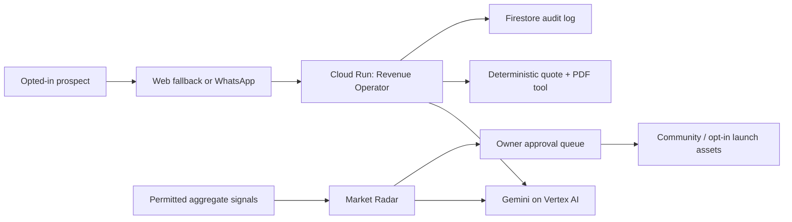

# Jill Revenue Agent

An AI-operated, WhatsApp-first lead-to-cash product for field-service businesses. It is designed for the Build with Gemini XPRIZE Small Business Services category.

## What runs autonomously

| Workflow | Agent action | Human/business control |
|---|---|---|
| Market Radar | Scores permitted aggregate niche/region signals and writes campaign assets | Approves every publication or message |
| Revenue Operator | Structures opted-in job notes into a non-binding quote draft and records an audit trail | Approves pricing, customer delivery, payment details and follow-ups |
| Consent | Suppresses opted-out contacts | Sets retention policy and handles data requests |
| Payments | Creates a configured hosted-link reference only after quote approval | Owns provider account, payouts and all money movement |

The service never scrapes personal contact information, sends cold WhatsApp/SMS, autonomously spends money, or accesses a bank account.

## Run locally

1. Copy `.env.example` to `.env` and add `ADMIN_TOKEN`. For live Gemini calls, configure local Application Default Credentials and `GOOGLE_CLOUD_PROJECT`; without those, quote creation safely falls back to a zero-priced draft.
2. `npm install`
3. `npm run dev`
4. Open `http://localhost:8080`; owner controls are at `/dashboard.html`.

## Deploy to Cloud Run

Enable Vertex AI and Firestore in a Google Cloud project, then deploy:

```bash
gcloud builds submit --config cloudbuild.yaml --substitutions=_REGION=us-central1
```

Set secrets/environment variables in Cloud Run rather than source control:

- `ADMIN_TOKEN` (required before using owner controls)
- `WHATSAPP_VERIFY_TOKEN`, `WHATSAPP_ACCESS_TOKEN`, `WHATSAPP_PHONE_NUMBER_ID` (when Meta is ready)
- `PAYMENT_LINK_TEMPLATE` and `EFT_BANK_DETAILS` (only when a legitimate provider/bank workflow is configured)

Grant the deployed Cloud Run service account **Vertex AI User** and Firestore access. Configure Meta’s webhook at `/webhooks/whatsapp`; the service only logs inbound events until the business has given consent and approved a response workflow.

## Evidence workflow

Use [`evidence/README.md`](evidence/README.md) during the pilot. Keep private customer information outside the repository, export anonymised logs for the submission, and do not alter the repository after the submission deadline.

## Architecture


