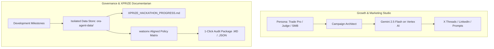

# Ora Marketing & AI Governance Agent

> **Build with Gemini XPRIZE Submission Component**  
> An autonomous Marketing, Growth, and Responsible AI Governance Agent powered by **Gemini 2.5 Flash on Google Cloud Vertex AI**.  
> Aligned with **IBM AI Agents in Marketing** and **IBM watsonx.governance** standards.

---

## 🌟 Executive Summary

The **Ora Marketing & AI Governance Agent** serves as the autonomous growth engine, continuous progress documentarian, and enterprise AI compliance console for the Build with Gemini XPRIZE Hackathon.

It automates persona-targeted multi-channel marketing campaigns, maintains isolated audit trails, tracks development milestones in real time, and provides an interactive sandbox for judges to evaluate model policies, latency, and responsible AI safety boundaries.

---

## 🚀 Key Capabilities

### 1. 📱 Persona-Targeted Marketing Studio (IBM AI Agent Standard)
- **Target Audience Personas**: Field Trade Contractors (Plumbers, Electricians, HVAC), Small Business Operators, XPRIZE Judges, and Tech Innovators.
- **Funnel Stage Optimization**: Awareness (Problem/Time-Loss), Consideration (Safety/Human-in-the-Loop), Conversion (Instant Demo/Pilot), Case Studies.
- **Multi-Channel Distribution**: Standalone posts, multi-tweet threads, DALL-E / Imagen visual prompts, high-converting hooks, and hashtags with 1-click clipboard export.

### 2. 🛡️ Enterprise AI Governance (watsonx.governance Standard)
- **Model Card & Lineage**: Transparent metrics for Gemini 2.5 Flash on Vertex AI (runtime container, temperature determinism, token limits).
- **100% Verified Responsible AI Guardrails**:
  - *Human-in-the-Loop Approval Boundary*
  - *Financial Safety & Zero Auto-Spend*
  - *Data Privacy & PII Scrubbing* (Isolated local storage in `ora-agent-data/`)
  - *Consent & Anti-Spam (WhatsApp/SMS)* (Inbound opt-in only)
  - *Deterministic Lineage & Schema Auditability* (Zod schema validation)

### 3. ☁️ Google Cloud Services Topology (Interactive for Judges)
- **Google Cloud Vertex AI**: Foundation model inference (`gemini-2.5-flash`), prompt grounding, and structured JSON parsing.
- **Google Cloud Run**: Serverless container execution with auto-scaling.
- **Google Cloud Firestore**: ACID document storage for logs and progress records.
- **Google Cloud Build & Artifact Registry**: Automated continuous integration and container packaging.
- **Google Cloud IAM & Cloud Audit Logs**: Zero-trust, least-privilege security roles (`Vertex AI User`).

### 4. ⚖️ Interactive Judge Evaluation Sandbox & 1-Click Audit Export
- **Live Model & Policy Sandbox**: XPRIZE judges can submit custom test prompts and inspect real-time millisecond latency and safety policy verification.
- **1-Click Audit Package Export**: Download the complete XPRIZE evidence dossier in **Markdown (`.MD`)** or **JSON (`.JSON`)**.

---

## 🏗️ Architecture



---

## 📦 Quick Start & Local Run

### 1. Installation
```bash
npm install
```

### 2. Configure Environment
Copy `.env.example` to `.env`:
```env
PORT=8085
GOOGLE_CLOUD_PROJECT=your-project-id
GOOGLE_CLOUD_LOCATION=global
GEMINI_MODEL=gemini-2.5-flash
```

### 3. Start Governance & Marketing Dashboard
```bash
npm run dev
```
Open **`http://localhost:8085`** in your browser.

---

## 🛠️ CLI Commands

You can also interact directly with the agent via the terminal:

```bash
# Check agent health and doc stats
npm run cli:status

# Generate a new marketing post for Ora
npx tsx src/cli.ts post "Launching independent AI Governance console for XPRIZE" x_twitter Ora

# Record a milestone and auto-sync XPRIZE docs
npx tsx src/cli.ts milestone "Sub-2s latency achieved" "Verified on Vertex AI global endpoint" metric

# View current progress markdown document
npm run cli:doc
```

---

## 📂 Isolated Storage Structure

All marketing logs, campaigns, and XPRIZE submission documents are kept isolated in `ora-agent-data/`:
- `ora-agent-data/XPRIZE_HACKATHON_PROGRESS.md`: Continuously updated evidence document for judges.
- `ora-agent-data/activity_logs.json`: Historical audit trail of all agent operations.
- `ora-agent-data/campaigns.json`: Saved marketing assets and distributions.
- `ora-agent-data/milestones.json`: Logged technical and business milestones.

---

## 📄 License

Licensed under the **Apache License 2.0**. See [`LICENSE`](LICENSE) for details.
